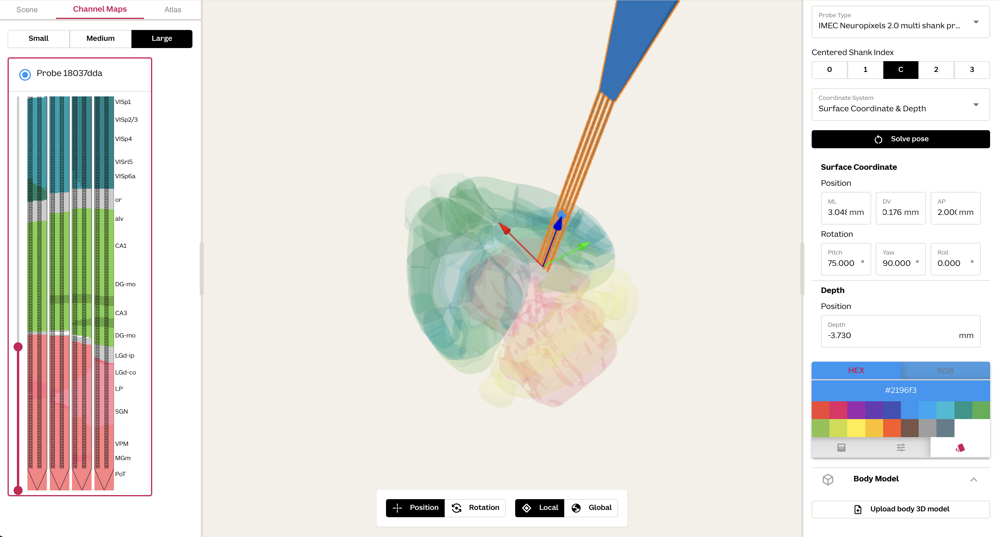

# Pinpoint V

Next-generation in vivo electrophysiology planning and automation tool.

# Usage & Documentation

[Launch the web app](https://pinpoint.allenneuraldynamics.org/v5/#/). Documentation is coming soon.

<!--For instructions, desktop releases, and tutorials please see the [documentation](https://virtualbrainlab.org/pinpoint/installation_and_use.html).-->

# Citing

A preprint describing Pinpoint has been reviewed in [eLife](https://elifesciences.org/reviewed-preprints/91662v1). The paper provides an introduction to the key features and should be used as a citation if Pinpoint proves integral to a scientific publication.
